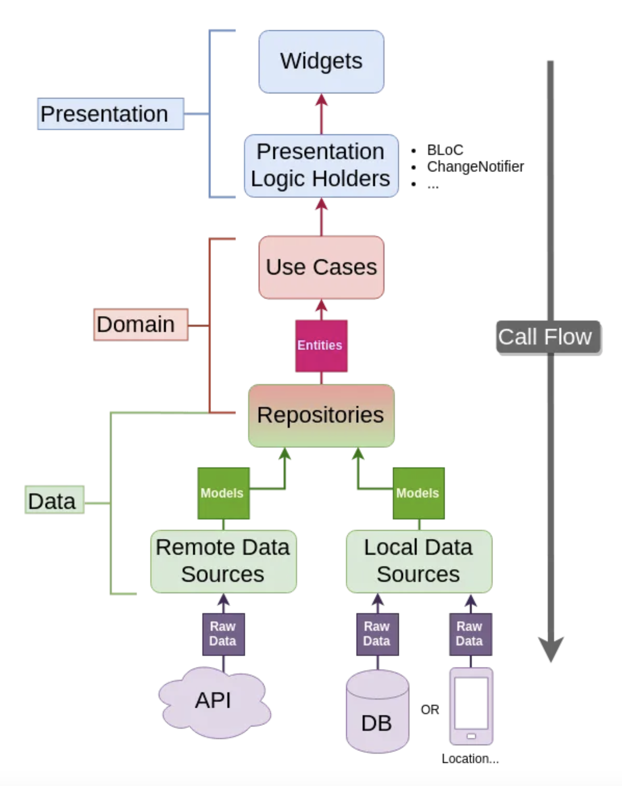

# Clean Architecture Template

&nbsp;

### Clean Architecture

Clean Architecture is a software design principle that promotes the separation of concerns and aims
to create a modular, scalable, and testable codebase. It is not specific to Flutter but can be
applied to any software development framework. Clean Architecture provides guidelines on how to
structure the codebase and define dependencies between different layers of an application.

In the context of Flutter, Clean Architecture typically consists of the following layers:
&nbsp;
1. **Presentation Layer (UI):** This layer contains the user interface components, such as widgets,
   pages, logic holders. It is responsible for handling user interactions and rendering the UI. The
   presentation layer should be independent of the business logic and data access implementation
   details.
2. **Domain Layer (Business Logic):** The domain layer represents the core business logic of the
   application. It contains use cases, entities, and business rules. Use cases define the operations
   or actions that can be performed in the application. Entities represent the essential objects in
   the domain and encapsulate their behavior and state. The domain layer should be agnostic of any
   specific framework or technology.
3. **Data Layer:** The data layer is responsible for data retrieval and storage. It consists of
   repositories and data sources. Repositories provide an abstraction layer for accessing and
   manipulating data. They define the contract or interface for data operations, which are
   implemented by the data sources. Data sources can be remote APIs, local databases, or other
   external data providers. The data layer shields the domain layer from the details of data storage
   and retrieval.

## Guidelines for Dependencies Between Layers:

The Clean Architecture principles suggest the following guidelines for dependencies between layers:
&nbsp;

* **The Presentation layer depends on the Domain layer:** The presentation layer interacts with the
  domain layer through interfaces or abstractions provided by the domain layer. This allows the
  business logic to be decoupled from the presentation layer.
* **The Domain layer is independent of other layers:** The domain layer contains the core business logic
  and should not have any dependencies on external frameworks, libraries, or UI-related components.
  This makes the domain layer reusable and platform-agnostic.
* **The Data layer depends on the Domain layer:** The data layer implements the interfaces or
  abstractions defined in the domain layer. This allows different data sources (e.g., APIs,
  databases) to be plugged into the application without affecting the domain layer.